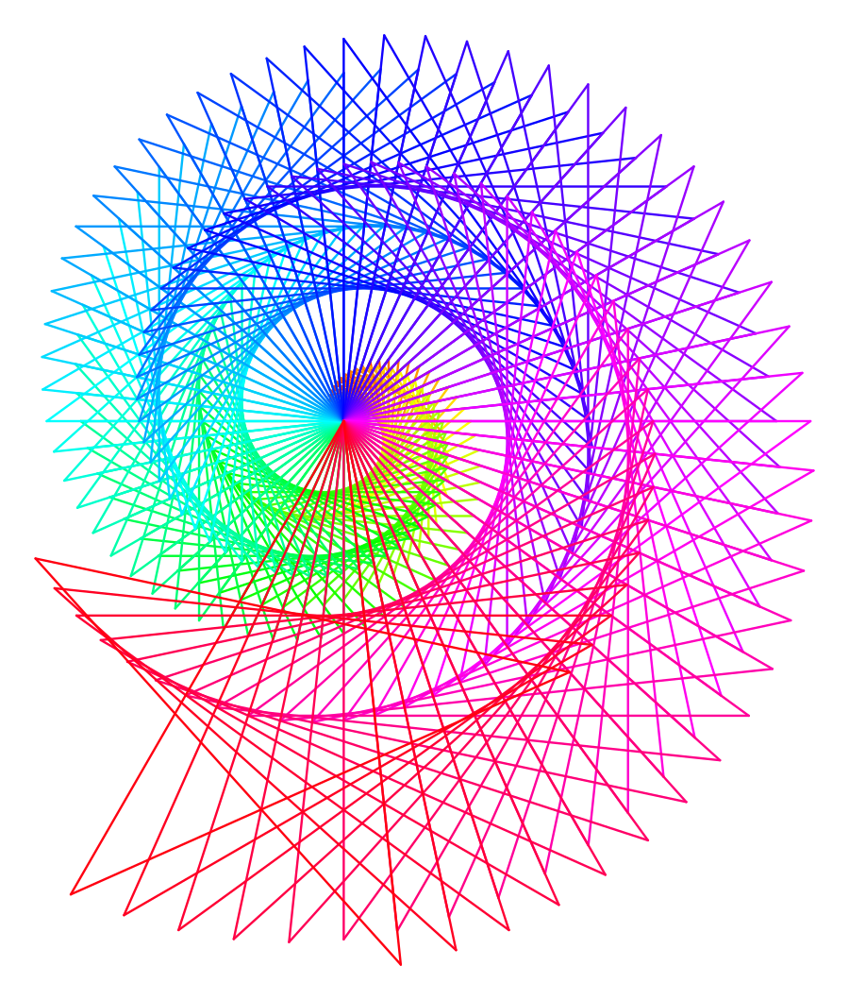

# ELEC7023 Workshop — Assignment 1: Python Basics

Han Xinpeng · ELEC7023 *Edge computing device programming for AI projects* (Jetson Nano AI-Kit)
Deadline: 22/9/2026 23:59pm

## What this is

One single Python file, `assignment 1_Han Xinpeng.py`, containing all three tasks of Assignment 1.
Run it and pick a task from the menu:

```bash
# on the Jetson Nano
cd ~/Desktop
python3 "assignment 1_Han Xinpeng.py"

# on Windows
python "assignment 1_Han Xinpeng.py"
```

```
===== Assignment 1: Python Basics =====
1. Simple Calculator
2. QA Bot
3. Turtle Drawing (bonus)
0. Quit
```

## Tasks

| Task | Requirement (from the slides) | Implementation |
| --- | --- | --- |
| **A. Simple Calculator** | Prompt for the first number, prompt for the second number, choose operator (`+ - * /`), display a clear math result. | `float(input())` for both numbers, then an `if / elif / else` chain on the operator — the same structure as the code hint on the slides. Input is validated, so typing a non-number asks again instead of crashing; division by zero and an unknown operator print a message. |
| **B. QA Bot** | Interactive bot that matches user queries with conditional logic: `input()` + `if / elif / else`, at least 5 keywords (`hello`, `python`, `jetson`, `ai`, `name`). | All 5 required keywords are matched, plus `bye` to exit. The reply strings are copied from the hint slide. Input is lower-cased and stripped, so `HELLO` or `" python "` still match. The bot keeps asking until the user says bye; anything unknown falls through to `else`. |
| **C. Turtle Drawing** (bonus) | Show creativity with turtle: draw a square / triangle / star, colourful patterns, dynamically change colour & length, structured `for` loops. | A rainbow star burst. A `for` loop draws 90 five-point stars (144° turns). The colour comes from `colorsys.hsv_to_rgb()` walking around the colour wheel, and every star is 4 px longer than the previous one — so colour and length both change dynamically. |

## Verified output

Tested by running the real file (Python 3.14) and feeding each input in turn:

| Input given to the program | Output |
| --- | --- |
| Calculator: `3`, `4`, `+` | `Result: 7` |
| Calculator: `1.5`, `2.25`, `+` | `Result: 3.75` |
| Calculator: `10`, `4`, `-` | `Result: 6` |
| Calculator: `3`, `4`, `*` | `Result: 12` |
| Calculator: `8`, `2`, `/` | `Result: 4` |
| Calculator: `5`, `0`, `/` | `Result: cannot divide by zero` |
| Calculator: `5`, `2`, `^` | `Invalid operation` |
| Calculator: `abc` as a number | `'abc' is not a number, please try again.` (then it asks again) |
| Bot: `hello` | `Bot: Hello! Nice to meet you.` |
| Bot: `python` | `Bot: Python is a language.` |
| Bot: `jetson` | `Bot: Jetson Nano is an AI computer.` |
| Bot: `ai` | `Bot: AI means Artificial Intelligence.` |
| Bot: `name` | `Bot: My name is Python Bot.` |
| Bot: `HELLO` | `Bot: Hello! Nice to meet you.` |
| Bot: `weather` | `Bot: Sorry, I don't understand.` |
| Bot: `bye` | `Bot: Goodbye!` (returns to the menu) |
| Turtle | 90 stars, 450 line segments, full colour wheel — window opens and draws |

## Task C result



90 rainbow stars — colour walks around the HSV colour wheel, length grows 4 px per star.

## Notes

- Task C opens a turtle window, so run it on the Nano desktop (or any machine with a display), not over SSH.
- The file name follows the submission guidelines on the slides (`assignment 1_yourname.py`). The task page writes `assignment one_yourname.py` — same file, only the spelling of "one" differs.
- The required file header is embedded at the top of the `.py` file:

  ```python
  # Name: Han Xinpeng
  # Assignment One
  # ddl is 22/9/2026 23:59pm
  ```
